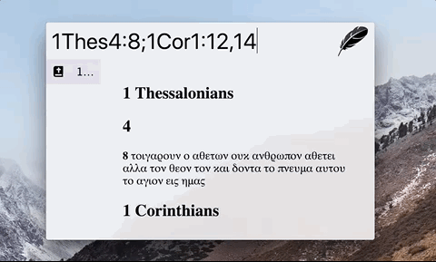

## Zazu Bible

[Zazu](http://zazuapp.org/) plugin for finding bible passages.

## Usage

Open Zazu and type in any number of books, chapters or verses. Here are a few
examples:

* `Jn15:17`
* `John15:17`
* `1Thes4:8;1Cor1:12,14`

## Installing

Add `teldosas/zazu-bible` inside of `plugins` block of your  `~/.zazurc.json` file.

~~~ json
"teldosas/zazu-bible"
~~~

You can also define a bible version of your choice.

You can find the abbreviation for the available versions
[here](https://getbible.net/api) under `AVAILABLE VERSIONS`

~~~ json
{
  "plugins": [
    {
      "name": "teldosas/zazu-bible",
      "variables": {
        "version": "text"
      }
    },
  ]
}
~~~

## Screenshots

